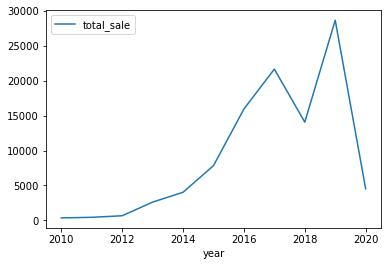
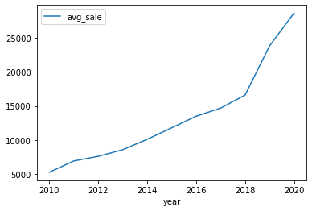
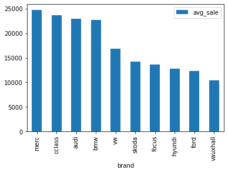
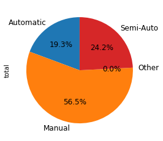
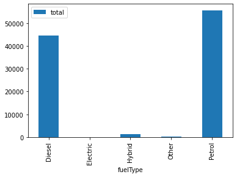

```python
#Import libraries
import numpy as np 
import pandas as pd
import sqlite3 as sq
import seaborn as sns
import matplotlib.pyplot as plt 
%matplotlib inline
```


```python
#Import data csv files
df1=pd.read_csv('D:/tableau/Uk used cars/audi.csv')
df2=pd.read_csv('D:/tableau/Uk used cars/bmw.csv')
df3=pd.read_csv('D:/tableau/Uk used cars/cclass.csv')
df4=pd.read_csv('D:/tableau/Uk used cars/focus.csv')
df5=pd.read_csv('D:/tableau/Uk used cars/ford.csv')
df6=pd.read_csv('D:/tableau/Uk used cars/hyundi.csv')
df7=pd.read_csv('D:/tableau/Uk used cars/merc.csv')
df8=pd.read_csv('D:/tableau/Uk used cars/skoda.csv')
df9=pd.read_csv('D:/tableau/Uk used cars/vauxhall.csv')
df10=pd.read_csv('D:/tableau/Uk used cars/vw.csv')
```


```python
#create new collume named 'brand' for each data frame
df1['brand']='audi'
df2['brand']='bmw'
df3['brand']='cclass'
df4['brand']='focus'
df5['brand']='ford'
df6['brand']='hyundi'
df7['brand']='merc'
df8['brand']='skoda'
df9['brand']='vauxhall'
df10['brand']='vw'
```


```python
#Merge all data sets to 1 data frame
df=pd.concat([df1,df2,df3,df4,df5,df6,df7,df8,df9,df10])
df
```


<div>
<style scoped>
    .dataframe tbody tr th:only-of-type {
        vertical-align: middle;
    }

    .dataframe tbody tr th {
        vertical-align: top;
    }

    .dataframe thead th {
        text-align: right;
    }
</style>
<table border="1" class="dataframe">
  <thead>
    <tr style="text-align: right;">
      <th></th>
      <th>model</th>
      <th>year</th>
      <th>price</th>
      <th>transmission</th>
      <th>mileage</th>
      <th>fuelType</th>
      <th>tax</th>
      <th>mpg</th>
      <th>engineSize</th>
      <th>brand</th>
    </tr>
  </thead>
  <tbody>
    <tr>
      <th>0</th>
      <td>A1</td>
      <td>2017</td>
      <td>12500</td>
      <td>Manual</td>
      <td>15735</td>
      <td>Petrol</td>
      <td>150.0</td>
      <td>55.4</td>
      <td>1.4</td>
      <td>audi</td>
    </tr>
    <tr>
      <th>1</th>
      <td>A6</td>
      <td>2016</td>
      <td>16500</td>
      <td>Automatic</td>
      <td>36203</td>
      <td>Diesel</td>
      <td>20.0</td>
      <td>64.2</td>
      <td>2.0</td>
      <td>audi</td>
    </tr>
    <tr>
      <th>2</th>
      <td>A1</td>
      <td>2016</td>
      <td>11000</td>
      <td>Manual</td>
      <td>29946</td>
      <td>Petrol</td>
      <td>30.0</td>
      <td>55.4</td>
      <td>1.4</td>
      <td>audi</td>
    </tr>
    <tr>
      <th>3</th>
      <td>A4</td>
      <td>2017</td>
      <td>16800</td>
      <td>Automatic</td>
      <td>25952</td>
      <td>Diesel</td>
      <td>145.0</td>
      <td>67.3</td>
      <td>2.0</td>
      <td>audi</td>
    </tr>
    <tr>
      <th>4</th>
      <td>A3</td>
      <td>2019</td>
      <td>17300</td>
      <td>Manual</td>
      <td>1998</td>
      <td>Petrol</td>
      <td>145.0</td>
      <td>49.6</td>
      <td>1.0</td>
      <td>audi</td>
    </tr>
    <tr>
      <th>...</th>
      <td>...</td>
      <td>...</td>
      <td>...</td>
      <td>...</td>
      <td>...</td>
      <td>...</td>
      <td>...</td>
      <td>...</td>
      <td>...</td>
      <td>...</td>
    </tr>
    <tr>
      <th>15152</th>
      <td>Eos</td>
      <td>2012</td>
      <td>5990</td>
      <td>Manual</td>
      <td>74000</td>
      <td>Diesel</td>
      <td>125.0</td>
      <td>58.9</td>
      <td>2.0</td>
      <td>vw</td>
    </tr>
    <tr>
      <th>15153</th>
      <td>Fox</td>
      <td>2008</td>
      <td>1799</td>
      <td>Manual</td>
      <td>88102</td>
      <td>Petrol</td>
      <td>145.0</td>
      <td>46.3</td>
      <td>1.2</td>
      <td>vw</td>
    </tr>
    <tr>
      <th>15154</th>
      <td>Fox</td>
      <td>2009</td>
      <td>1590</td>
      <td>Manual</td>
      <td>70000</td>
      <td>Petrol</td>
      <td>200.0</td>
      <td>42.0</td>
      <td>1.4</td>
      <td>vw</td>
    </tr>
    <tr>
      <th>15155</th>
      <td>Fox</td>
      <td>2006</td>
      <td>1250</td>
      <td>Manual</td>
      <td>82704</td>
      <td>Petrol</td>
      <td>150.0</td>
      <td>46.3</td>
      <td>1.2</td>
      <td>vw</td>
    </tr>
    <tr>
      <th>15156</th>
      <td>Fox</td>
      <td>2007</td>
      <td>2295</td>
      <td>Manual</td>
      <td>74000</td>
      <td>Petrol</td>
      <td>145.0</td>
      <td>46.3</td>
      <td>1.2</td>
      <td>vw</td>
    </tr>
  </tbody>
</table>
<p>101802 rows × 10 columns</p>
</div>


```python
#Checking Data Frame(DF) info
df.info()
```

    <class 'pandas.core.frame.DataFrame'>
    Int64Index: 101802 entries, 0 to 15156
    Data columns (total 10 columns):
     #   Column        Non-Null Count   Dtype  
    ---  ------        --------------   -----  
     0   model         101802 non-null  object 
     1   year          101802 non-null  int64  
     2   price         101802 non-null  int64  
     3   transmission  101802 non-null  object 
     4   mileage       101802 non-null  int64  
     5   fuelType      101802 non-null  object 
     6   tax           92449 non-null   float64
     7   mpg           92449 non-null   float64
     8   engineSize    101802 non-null  float64
     9   brand         101802 non-null  object 
    dtypes: float64(3), int64(3), object(4)
    memory usage: 8.5+ MB
    


```python
#create new database for SQL
conn=sq.connect('UK_used_cars.db')
```


```python
#Create new table 'cars' in data base UK_used_cars
#Import data from DF to table cars
df.to_sql('cars', conn, if_exists='replace', index=False)
```


    101802


```python
#Check new table cars
pd.read_sql('select * from cars;',conn)
```


<div>
<style scoped>
    .dataframe tbody tr th:only-of-type {
        vertical-align: middle;
    }

    .dataframe tbody tr th {
        vertical-align: top;
    }

    .dataframe thead th {
        text-align: right;
    }
</style>
<table border="1" class="dataframe">
  <thead>
    <tr style="text-align: right;">
      <th></th>
      <th>model</th>
      <th>year</th>
      <th>price</th>
      <th>transmission</th>
      <th>mileage</th>
      <th>fuelType</th>
      <th>tax</th>
      <th>mpg</th>
      <th>engineSize</th>
      <th>brand</th>
    </tr>
  </thead>
  <tbody>
    <tr>
      <th>0</th>
      <td>A1</td>
      <td>2017</td>
      <td>12500</td>
      <td>Manual</td>
      <td>15735</td>
      <td>Petrol</td>
      <td>150.0</td>
      <td>55.4</td>
      <td>1.4</td>
      <td>audi</td>
    </tr>
    <tr>
      <th>1</th>
      <td>A6</td>
      <td>2016</td>
      <td>16500</td>
      <td>Automatic</td>
      <td>36203</td>
      <td>Diesel</td>
      <td>20.0</td>
      <td>64.2</td>
      <td>2.0</td>
      <td>audi</td>
    </tr>
    <tr>
      <th>2</th>
      <td>A1</td>
      <td>2016</td>
      <td>11000</td>
      <td>Manual</td>
      <td>29946</td>
      <td>Petrol</td>
      <td>30.0</td>
      <td>55.4</td>
      <td>1.4</td>
      <td>audi</td>
    </tr>
    <tr>
      <th>3</th>
      <td>A4</td>
      <td>2017</td>
      <td>16800</td>
      <td>Automatic</td>
      <td>25952</td>
      <td>Diesel</td>
      <td>145.0</td>
      <td>67.3</td>
      <td>2.0</td>
      <td>audi</td>
    </tr>
    <tr>
      <th>4</th>
      <td>A3</td>
      <td>2019</td>
      <td>17300</td>
      <td>Manual</td>
      <td>1998</td>
      <td>Petrol</td>
      <td>145.0</td>
      <td>49.6</td>
      <td>1.0</td>
      <td>audi</td>
    </tr>
    <tr>
      <th>...</th>
      <td>...</td>
      <td>...</td>
      <td>...</td>
      <td>...</td>
      <td>...</td>
      <td>...</td>
      <td>...</td>
      <td>...</td>
      <td>...</td>
      <td>...</td>
    </tr>
    <tr>
      <th>101797</th>
      <td>Eos</td>
      <td>2012</td>
      <td>5990</td>
      <td>Manual</td>
      <td>74000</td>
      <td>Diesel</td>
      <td>125.0</td>
      <td>58.9</td>
      <td>2.0</td>
      <td>vw</td>
    </tr>
    <tr>
      <th>101798</th>
      <td>Fox</td>
      <td>2008</td>
      <td>1799</td>
      <td>Manual</td>
      <td>88102</td>
      <td>Petrol</td>
      <td>145.0</td>
      <td>46.3</td>
      <td>1.2</td>
      <td>vw</td>
    </tr>
    <tr>
      <th>101799</th>
      <td>Fox</td>
      <td>2009</td>
      <td>1590</td>
      <td>Manual</td>
      <td>70000</td>
      <td>Petrol</td>
      <td>200.0</td>
      <td>42.0</td>
      <td>1.4</td>
      <td>vw</td>
    </tr>
    <tr>
      <th>101800</th>
      <td>Fox</td>
      <td>2006</td>
      <td>1250</td>
      <td>Manual</td>
      <td>82704</td>
      <td>Petrol</td>
      <td>150.0</td>
      <td>46.3</td>
      <td>1.2</td>
      <td>vw</td>
    </tr>
    <tr>
      <th>101801</th>
      <td>Fox</td>
      <td>2007</td>
      <td>2295</td>
      <td>Manual</td>
      <td>74000</td>
      <td>Petrol</td>
      <td>145.0</td>
      <td>46.3</td>
      <td>1.2</td>
      <td>vw</td>
    </tr>
  </tbody>
</table>
<p>101802 rows × 10 columns</p>
</div>


```python
#How many cars sell per brand at all time?
brand_sale=pd.read_sql("""select brand, count(price) as total_sale 
                        from cars 
                        group by brand
                        order by total_sale desc;""",conn)
brand_sale
```


<div>
<style scoped>
    .dataframe tbody tr th:only-of-type {
        vertical-align: middle;
    }

    .dataframe tbody tr th {
        vertical-align: top;
    }

    .dataframe thead th {
        text-align: right;
    }
</style>
<table border="1" class="dataframe">
  <thead>
    <tr style="text-align: right;">
      <th></th>
      <th>brand</th>
      <th>total_sale</th>
    </tr>
  </thead>
  <tbody>
    <tr>
      <th>0</th>
      <td>ford</td>
      <td>17965</td>
    </tr>
    <tr>
      <th>1</th>
      <td>vw</td>
      <td>15157</td>
    </tr>
    <tr>
      <th>2</th>
      <td>vauxhall</td>
      <td>13632</td>
    </tr>
    <tr>
      <th>3</th>
      <td>merc</td>
      <td>13119</td>
    </tr>
    <tr>
      <th>4</th>
      <td>bmw</td>
      <td>10781</td>
    </tr>
    <tr>
      <th>5</th>
      <td>audi</td>
      <td>10668</td>
    </tr>
    <tr>
      <th>6</th>
      <td>skoda</td>
      <td>6267</td>
    </tr>
    <tr>
      <th>7</th>
      <td>focus</td>
      <td>5454</td>
    </tr>
    <tr>
      <th>8</th>
      <td>hyundi</td>
      <td>4860</td>
    </tr>
    <tr>
      <th>9</th>
      <td>cclass</td>
      <td>3899</td>
    </tr>
  </tbody>
</table>
</div>


```python
#Visualize brand_sale 
fig, axes = plt.subplots(figsize=(15,5),nrows=1, ncols=2)
brand_sale.plot(ax=axes[0], kind='bar', x='brand')
brand_sale.plot(ax=axes[1], kind='pie', y = 'total_sale', autopct='%1.1f%%', 
 startangle=90, shadow=False, labels=brand_sale['brand'], legend = False, fontsize=9)
```


    <AxesSubplot:ylabel='total_sale'>


    

    


```python
#How many cars sell per year?
year_sale=pd.read_sql("""select year, count(price) as total_sale 
                        from cars 
                        where year between '2010' and '2020'
                        group by year
                        order by year desc;""",conn)
year_sale
```


<div>
<style scoped>
    .dataframe tbody tr th:only-of-type {
        vertical-align: middle;
    }

    .dataframe tbody tr th {
        vertical-align: top;
    }

    .dataframe thead th {
        text-align: right;
    }
</style>
<table border="1" class="dataframe">
  <thead>
    <tr style="text-align: right;">
      <th></th>
      <th>year</th>
      <th>total_sale</th>
    </tr>
  </thead>
  <tbody>
    <tr>
      <th>0</th>
      <td>2020</td>
      <td>4529</td>
    </tr>
    <tr>
      <th>1</th>
      <td>2019</td>
      <td>28669</td>
    </tr>
    <tr>
      <th>2</th>
      <td>2018</td>
      <td>14077</td>
    </tr>
    <tr>
      <th>3</th>
      <td>2017</td>
      <td>21667</td>
    </tr>
    <tr>
      <th>4</th>
      <td>2016</td>
      <td>15951</td>
    </tr>
    <tr>
      <th>5</th>
      <td>2015</td>
      <td>7834</td>
    </tr>
    <tr>
      <th>6</th>
      <td>2014</td>
      <td>4025</td>
    </tr>
    <tr>
      <th>7</th>
      <td>2013</td>
      <td>2614</td>
    </tr>
    <tr>
      <th>8</th>
      <td>2012</td>
      <td>660</td>
    </tr>
    <tr>
      <th>9</th>
      <td>2011</td>
      <td>437</td>
    </tr>
    <tr>
      <th>10</th>
      <td>2010</td>
      <td>351</td>
    </tr>
  </tbody>
</table>
</div>


```python
#Visualize Year_sale
year_sale.plot(kind='line',x='year', y='total_sale')
```


    <AxesSubplot:xlabel='year'>


    

    


```python
# The average price of cars in each year from 2010 to 2020
year_avg=pd.read_sql("""select year, avg(price) as avg_sale 
                        from cars 
                        where year between '2010' and '2020'
                        group by year
                        order by year desc;""",conn)
year_avg
```


<div>
<style scoped>
    .dataframe tbody tr th:only-of-type {
        vertical-align: middle;
    }

    .dataframe tbody tr th {
        vertical-align: top;
    }

    .dataframe thead th {
        text-align: right;
    }
</style>
<table border="1" class="dataframe">
  <thead>
    <tr style="text-align: right;">
      <th></th>
      <th>year</th>
      <th>avg_sale</th>
    </tr>
  </thead>
  <tbody>
    <tr>
      <th>0</th>
      <td>2020</td>
      <td>28674.671009</td>
    </tr>
    <tr>
      <th>1</th>
      <td>2019</td>
      <td>23841.546897</td>
    </tr>
    <tr>
      <th>2</th>
      <td>2018</td>
      <td>16593.562407</td>
    </tr>
    <tr>
      <th>3</th>
      <td>2017</td>
      <td>14675.413717</td>
    </tr>
    <tr>
      <th>4</th>
      <td>2016</td>
      <td>13478.672309</td>
    </tr>
    <tr>
      <th>5</th>
      <td>2015</td>
      <td>11772.556931</td>
    </tr>
    <tr>
      <th>6</th>
      <td>2014</td>
      <td>10079.942857</td>
    </tr>
    <tr>
      <th>7</th>
      <td>2013</td>
      <td>8550.391737</td>
    </tr>
    <tr>
      <th>8</th>
      <td>2012</td>
      <td>7577.007576</td>
    </tr>
    <tr>
      <th>9</th>
      <td>2011</td>
      <td>6892.727689</td>
    </tr>
    <tr>
      <th>10</th>
      <td>2010</td>
      <td>5225.760684</td>
    </tr>
  </tbody>
</table>
</div>


```python
year_avg.plot(kind='line',x='year', y='avg_sale')
```


    <AxesSubplot:xlabel='year'>


    

    


```python
# The average price of cars in each year from 2010 to 2020
brand_avg=pd.read_sql("""select brand, avg(price) as avg_sale 
                        from cars 
                        group by brand
                        order by avg_sale desc;""",conn)
brand_avg
```


<div>
<style scoped>
    .dataframe tbody tr th:only-of-type {
        vertical-align: middle;
    }

    .dataframe tbody tr th {
        vertical-align: top;
    }

    .dataframe thead th {
        text-align: right;
    }
</style>
<table border="1" class="dataframe">
  <thead>
    <tr style="text-align: right;">
      <th></th>
      <th>brand</th>
      <th>avg_sale</th>
    </tr>
  </thead>
  <tbody>
    <tr>
      <th>0</th>
      <td>merc</td>
      <td>24698.596920</td>
    </tr>
    <tr>
      <th>1</th>
      <td>cclass</td>
      <td>23674.286997</td>
    </tr>
    <tr>
      <th>2</th>
      <td>audi</td>
      <td>22896.685039</td>
    </tr>
    <tr>
      <th>3</th>
      <td>bmw</td>
      <td>22733.408867</td>
    </tr>
    <tr>
      <th>4</th>
      <td>vw</td>
      <td>16838.952365</td>
    </tr>
    <tr>
      <th>5</th>
      <td>skoda</td>
      <td>14275.449338</td>
    </tr>
    <tr>
      <th>6</th>
      <td>focus</td>
      <td>13581.958379</td>
    </tr>
    <tr>
      <th>7</th>
      <td>hyundi</td>
      <td>12750.131070</td>
    </tr>
    <tr>
      <th>8</th>
      <td>ford</td>
      <td>12279.756415</td>
    </tr>
    <tr>
      <th>9</th>
      <td>vauxhall</td>
      <td>10406.457893</td>
    </tr>
  </tbody>
</table>
</div>


```python
#Visualize the brand_avg
brand_avg.plot(kind='bar', x='brand')
```


    <AxesSubplot:xlabel='brand'>


    

    


```python
trans=pd.read_sql("""select transmission, count(price) as total 
                        from cars 
                        group by transmission;""",conn)
trans
```


<div>
<style scoped>
    .dataframe tbody tr th:only-of-type {
        vertical-align: middle;
    }

    .dataframe tbody tr th {
        vertical-align: top;
    }

    .dataframe thead th {
        text-align: right;
    }
</style>
<table border="1" class="dataframe">
  <thead>
    <tr style="text-align: right;">
      <th></th>
      <th>transmission</th>
      <th>total</th>
    </tr>
  </thead>
  <tbody>
    <tr>
      <th>0</th>
      <td>Automatic</td>
      <td>19662</td>
    </tr>
    <tr>
      <th>1</th>
      <td>Manual</td>
      <td>57482</td>
    </tr>
    <tr>
      <th>2</th>
      <td>Other</td>
      <td>9</td>
    </tr>
    <tr>
      <th>3</th>
      <td>Semi-Auto</td>
      <td>24649</td>
    </tr>
  </tbody>
</table>
</div>


```python
trans.plot(kind='pie', y = 'total', autopct='%1.1f%%', 
 startangle=90, shadow=False, labels=trans['transmission'], legend = False, fontsize=12)
```


    <AxesSubplot:ylabel='total'>


    

    


```python
fuel=pd.read_sql("""select fuelType, count(price) as total 
                        from cars 
                        group by fuelType;""",conn)
fuel
```


<div>
<style scoped>
    .dataframe tbody tr th:only-of-type {
        vertical-align: middle;
    }

    .dataframe tbody tr th {
        vertical-align: top;
    }

    .dataframe thead th {
        text-align: right;
    }
</style>
<table border="1" class="dataframe">
  <thead>
    <tr style="text-align: right;">
      <th></th>
      <th>fuelType</th>
      <th>total</th>
    </tr>
  </thead>
  <tbody>
    <tr>
      <th>0</th>
      <td>Diesel</td>
      <td>44674</td>
    </tr>
    <tr>
      <th>1</th>
      <td>Electric</td>
      <td>6</td>
    </tr>
    <tr>
      <th>2</th>
      <td>Hybrid</td>
      <td>1186</td>
    </tr>
    <tr>
      <th>3</th>
      <td>Other</td>
      <td>148</td>
    </tr>
    <tr>
      <th>4</th>
      <td>Petrol</td>
      <td>55788</td>
    </tr>
  </tbody>
</table>
</div>


```python
#Visualize the fuel type
fuel.plot(kind='bar', x='fuelType')
```


    <AxesSubplot:xlabel='fuelType'>


    

    


```python

```
